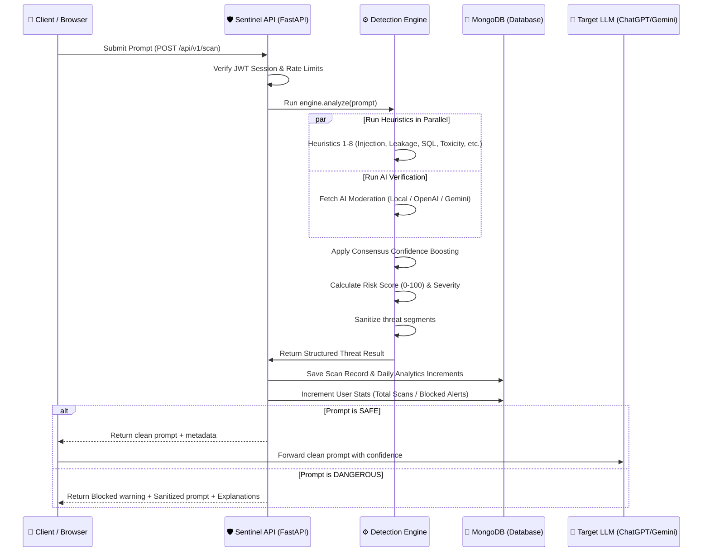

# 🛡️ Sentinel AI — AI Prompt Security Gateway

  
  
  
  
  

### Scan, detect, and neutralize prompt threats in real-time before they reach your LLMs (ChatGPT, Claude, Gemini).

Sentinel AI is a high-performance, enterprise-grade **Prompt Firewall & Threat Detection Gateway**. It acts as a security middleware sitting between your users and your Large Language Models (LLMs), identifying prompt injection, jailbreaks, data leakage, and system manipulation within milliseconds.

## 🌟 Key Features

* **8-Layer Hybrid Threat Detection Engine**: Scans prompts using high-speed deterministic heuristics and pattern matching.
* **AI-Augmented Cloud Moderation**: Optionally connects with OpenAI Moderation API or Google Gemini Safety Filters with automatic local fallback.
* **Multi-Signal Consensus & Boosting**: Smart confidence-level adjustment if both heuristic filters and AI analysis flag the same threat.
* **Intelligent Risk Scoring**: Computes a dynamic risk score from 0-100 to classify prompt safety (LOW, MEDIUM, HIGH, CRITICAL).
* **Automatic Prompt Sanitizer**: Automatically strips matching threat segments and replaces them with clean `[SUSPICIOUS CONTENT REMOVED]` markers.
* **Interactive Analytics Dashboard**: Beautiful real-time telemetry charts tracking scan history, threat distributions, and attack rates.

## 🏗️ System Architecture & Request Flow

The diagram below details the end-to-end telemetry pathway when a client application submits a prompt for scanning:

