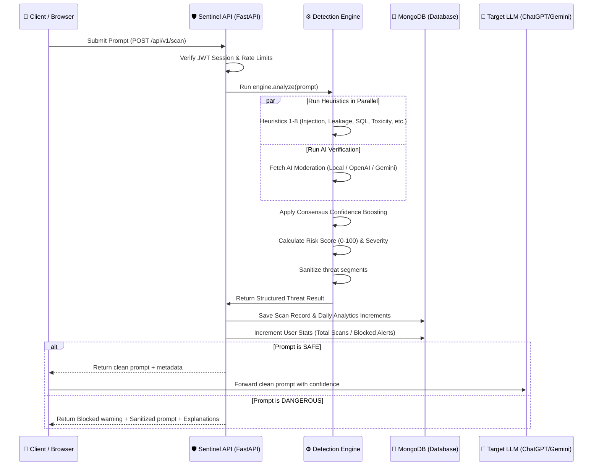

# 🛡️ Sentinel AI — AI Prompt Security Gateway

<p align="center">
  
  
  
  
  
</p>

### Scan, detect, and neutralize prompt threats in real-time before they reach your LLMs (ChatGPT, Claude, Gemini).

Sentinel AI is a high-performance, enterprise-grade **Prompt Firewall & Threat Detection Gateway**. It acts as a security middleware sitting between your users and your Large Language Models (LLMs), identifying prompt injection, jailbreaks, data leakage, and system manipulation within milliseconds.


## 🌟 Key Features

* **8-Layer Hybrid Threat Detection Engine**: Scans prompts using high-speed deterministic heuristics and pattern matching.
* **AI-Augmented Cloud Moderation**: Optionally connects with OpenAI Moderation API or Google Gemini Safety Filters with automatic local fallback.
* **Multi-Signal Consensus & Boosting**: Smart confidence-level adjustment if both heuristic filters and AI analysis flag the same threat.
* **Intelligent Risk Scoring**: Computes a dynamic risk score from 0-100 to classify prompt safety (LOW, MEDIUM, HIGH, CRITICAL).
* **Automatic Prompt Sanitizer**: Automatically strips matching threat segments and replaces them with clean `[SUSPICIOUS CONTENT REMOVED]` markers.
* **Interactive Analytics Dashboard**: Beautiful real-time telemetry charts tracking scan history, threat distributions, and attack rates.


## 🏗️ System Architecture & Request Flow

The diagram below details the end-to-end telemetry pathway when a client application submits a prompt for scanning:




## 🛡️ The 8-Layer Prompt Firewall

Sentinel AI deploys specialized, high-accuracy threat detectors running concurrently:

1. **Prompt Injection Detector**: Catches directives aimed at ignoring or overriding initial LLM system boundary prompts (e.g., *"ignore previous instructions"*).
2. **Jailbreak Detector**: Flags adversarial evasion formats designed to bypass safety policies (e.g., *"DAN mode"*, *"Do Anything Now"*).
3. **SQL Injection (SQLi) Detector**: Prevents attempts to pass database queries through AI input fields (e.g., *"UNION SELECT"*).
4. **Shell Command Detector**: Identifies bash or cmd instructions targeting target OS vulnerability scopes (e.g., *"`rm -rf /`"*).
5. **PII & Data Leakage Detector**: Stops users from uploading protected formats, credential tokens, or private details (e.g., API keys, SSNs, credit cards).
6. **Toxicity & Harassment Detector**: Screens out hate speech, explicit categories, and harassing remarks.
7. **Unsafe Code Detector**: Identifies potentially malicious script blocks or execution directives (`eval()`, `exec()`).
8. **Role Manipulation Detector**: Protects agent personas from hostile takeover attempts (e.g., *"You are now my hacker assistant"*).


## 🛠️ Technology Stack

### Backend API
* **Core**: Python 3.10+, FastAPI (Asynchronous execution model)
* **Database Client**: Motor (Async MongoDB ODM)
* **Authentication**: JWT (python-jose & passlib with bcrypt)
* **Rate Limiting**: Slowapi (Token bucket algorithm)
* **Configuration**: Pydantic Settings v2

### Frontend Dashboard
* **Core**: React 19, TypeScript
* **Router**: TanStack Router (Typesafe routing & state transitions)
* **Build Tool**: Vite 7
* **Styling**: Tailwind CSS v4, Framer Motion
* **Charts**: Recharts (Interactive SVG graphs)

---

## 📁 Repository Directory Structure

```
sentinel-ai/
├── backend/                   # 🐍 FastAPI Backend API
│   ├── app/
│   │   ├── api/               # API Router and endpoint route handlers
│   │   ├── auth/              # JWT Dependency validation
│   │   ├── core/              # Global settings configuration
│   │   ├── database/          # MongoDB connection and index logic
│   │   ├── detection/         # Hybrid Prompt Firewall detection modules
│   │   ├── middleware/        # CORS, logging, and rate limiters
│   │   ├── models/            # ODM database schemas
│   │   └── services/          # Business logic: scan orchestrator, analytics
│   ├── main.py                # Server entrypoint
│   └── requirements.txt       # Python dependencies list
│
├── ai-fortress-frontend/     # ⚛️ React & Tailwind Dashboard
│   ├── src/
│   │   ├── components/        # UI and App specific layout blocks
│   │   ├── hooks/             # Custom utility hooks (useMobile)
│   │   ├── lib/               # Global state, axios client, error hooks
│   │   └── routes/            # TanStack Router page views
│   ├── vite.config.ts         # Vite bundler options
│   └── wrangler.jsonc         # Cloudflare Workers configuration
│
└── docker-compose.yml         # Container Orchestration Manifest
```


## 🚀 Local Development Quickstart

### Prerequisites
* Python 3.10+
* Node.js 18+ & npm/bun
* MongoDB (running on `mongodb://localhost:27017`)

### 1. Run the Backend API
1. Navigate to the backend directory:
   ```bash
   cd backend
   ```
2. Set up a virtual environment and install packages:
   ```bash
   python -m venv venv
   .\\venv\\Scripts\\activate  # On Windows
   source venv/bin/activate  # On Unix/macOS
   pip install -r requirements.txt
   ```
3. Configure your environment in `.env` (Optional: add Gemini/OpenAI API keys for cloud augmentation):
   ```env
   MONGODB_URI=mongodb://localhost:27017
   DB_NAME=sentinel_ai
   JWT_SECRET=change-this-in-production
   ```
4. Start the development server:
   ```bash
   uvicorn main:app --reload --port 8000
   ```

### 2. Run the Frontend Dashboard
1. Navigate to the frontend directory:
   ```bash
   cd ../ai-fortress-frontend
   ```
2. Install dependencies and start the app:
   ```bash
   npm install
   npm run dev
   ```
3. Open `http://localhost:8080` in your web browser.


## 📄 API Endpoint Reference

All protected endpoints require your JWT auth token passed in the Authorization header: `Bearer <token>`.

### Authentication
* `POST /api/v1/auth/register` — Register a new account
* `POST /api/v1/auth/login` — Sign in and receive a JWT token
* `GET /api/v1/auth/profile` — Fetch active user account profile details

### Threat Scanner
* `POST /api/v1/scan` — Submit prompt payload for multi-signal analysis
* `GET /api/v1/scan/{scan_id}` — Retrieve the detailed scan results for a specific scan ID

### History & Telemetry
* `GET /api/v1/history` — Get a paginated history list of recent scans
* `GET /api/v1/analytics` — Pull aggregated safety telemetry for dashboard visual chart population
* `GET /api/v1/threats` — Browse the catalog of recognized threat categories
